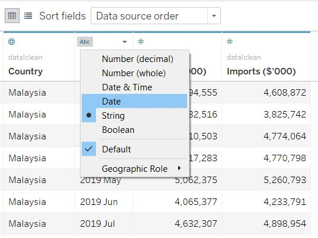
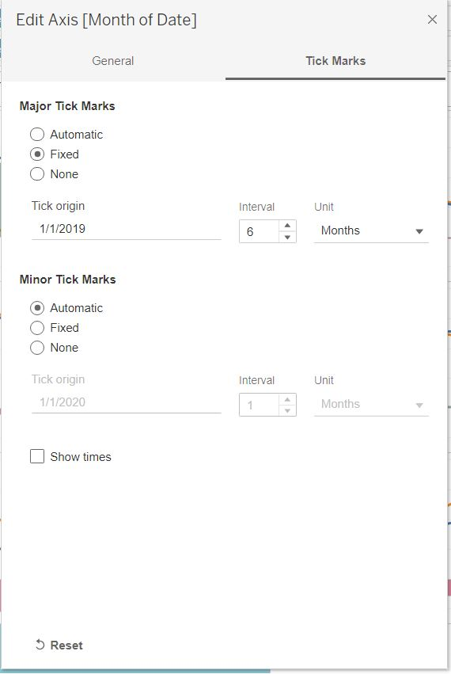

```{r setup, include=FALSE}
knitr::opts_chunk$set(echo = FALSE)
```

# 1. Original Visualisation


### Data Source

The data visualisation above is created by using data provided by Department of Statistics, Singapore (DOS). 

# 2. Critiques

### 2.1 Clarity

i. **Chart title is not aligned with the chart content**- Title reads as "Merchandise Trade of Top Six Trading Countries, 2019-2020". However, chart for Japan only reflects 2020 data.

ii. **Chart axis is misleading**- 
    (a) y-axis scale differs across each country's chart. This will mislead users who do not read the graph in detail.
    (b) Charts have dual y-axis for imports and exports. The scales for imports and exports within each country's chart are not synchronized and hence have different ranges. This makes it difficult to compare whether a country is in net export/ import position. This may also be misleading to users who do not read the graph in detail.
  
iii. **Chart did not specify criteria for which top 6 trading partners is chosen.**- Some considerations include:
    (a) Across which period, and
    (b) What is being considered- net trade import/ export or consider each separately?

iv. **Presentation may not be the most appropriate depending on purpose of what the author is trying to show**- 
    (a) Comparing import and export across time for each country, or 
    (b) Comparing net import/ export across time for each country.

v. **No commentary provided**- reader does not have commentary to understand the main idea of the visualisation.

vi. **Does not include data source**- reader is unable to verify the data, nor replicate the chart using source data.

### 2.2 Aesthetics

i. **Different alignments of x-axis**- charts of various thickness makes the entire visualisation look disorganised.

ii. **Chart title vs country name font size**- Font size of title should be larger than the country name.

iii. **Does not specify measurement currency**- reader will not know if figures for each country is measured in the same currency. This can be included in the axis information.

iv. **Annotations are not used to convey points**, leaving the reader to infer the purpose of the graph.

v. **Poor use of colors in the chart**- use of area chart with overlap of colors makes it difficult to read.

vi. **No tick marks for y-axis values** even though it's on a continuous scale.

# 3. Proposed Design

### Sketch


### Advantages of proposed design

### 3.1 Clarity

i. Chart title is aligned with the chart content- chart shows only the relevant periods as aligned with title.

ii. Chart axis is aligned across all 6 countries-
    (a) y-axis scale is aligned across each country's chart.
    (b) Charts have synchronized axis for imports and exports.

iii. Proposed chart shows exports, imports and net exports/imports across time for each country- users are able to identify trends across time for both exports and imports. This also reduces the need for users to manually compute the net export/import.
    
iv. Chart title provides audience with the big picture, followed by short commentary to provide more context.

v. Data source is included in chart.

### 3.2 Aesthetics

i. x-axis is aligned across each country's chart- this makes the visualisation more organised and allows users to compare the trends across time for each country.

ii. Font size for chart title, commentary and chart annotations have been adjusted so as not to divert reader's attention.

iii. Measurement currency is specified in the axis so reader will know at one glance.

iv. Annotations added to convey points.

v. Colors are consistent throughout the dashboard with clear legend on what they represent. Minimal overlapping of colors.

vi. Tick marks added to y-axis scale. Soft gridlines have also been added to the chart to provide reference but not to distract users.

# 4. Final Visualisation

### 4.1 Snapshot of dashboard


# 5. Data Visualisation Steps

1. After downloading the data, select data for the relevant countries from each dataset (import and export dataset) and paste into a new sheet using Microsoft Excel.


2. Transpose the extracted import and export data, naming the date column as "Date" and value column as "Imports"/ "Exports" respectively.

{width=50%}

3. Combine the transposed import and export data.

{width=50%}

4. Perform the following actions:

No  |Variable     | Action
----|-------------| ----------------------------------------
1   |Variables    | Rename column as "Country"
2   |Variables    | Removed "(Thousand Dollars)" from value
3   |Imports      | Rename column as "Imports (S\$'000)"
4   |Exports      | Rename column as "Exports (S\$'000)"

{width=50%}

After the above manipulations have been performed, save the data as "data_clean".


### 5.1 <Singapore's Trade with top 6 countries> sheet

5. Import the data into Tableau.

{width=50%}

6. Change data type- change Date data type to “Date”.

{width=75%}

7. As we will be presenting the charts for six countries in the form of a trellis, we have to create two calculated fields called "x-axis" and "y-axis".
    (a) Create a new calculated field and name it "x-axis", with the below formula (Figure 11).
    (b) Create another calculated field named "y-axis", with the below formula (Figure 12).

{width=50%}


7. Drag [Date] to columns and change selection to month. Change data type to continuous.

{width=50%}

8. Drag [Exports($'000)] to rows, then drag [Imports($'000)] and drop it into the chart as seen in Figure 13 below. This creates a measure values shelf that appears in the data pane and contains all the measures of the data collected into one field. 

{width=50%}

9. Drag the calculated fields [x-axis] and [y-axis] to Columns and Rows respectively.Convert both fields into discrete fields.

{width=75%}

10.Drag [Country] into the marks card under detail.

{width=50%}

10. Edit table calculation for both [x-axis] and [y-axis] calculated fields.Select computation using specific dimensions- by [Country] then by [Month of Date], at the level of [Country].

{width=50%}

11. Create another calculated field named [Net exports/imports], with the below formula.


12. Drag [Net exports/imports] into Rows and select dual axis.Right click on the axis and select synchronize axis (Figure 19).


13. On the Marks card for [net exports/imports], click the Mark Type drop-down and select bar.

{width=50%}

14. Drag [net exports/imports] to Color on the Marks. On the Marks card, click Color > Edit Colors.
    (a) Update stepped color option to 2 steps as we want to show negative and positive values in different colors
    (b) Click on the drop down under palette and select the red-green diverging option.
    (c) Adjust the slider under opacity to 50%.


{width=50%}

15. Hide the net export/ imports axis on the right by deselecting Show Header.

{width=50%}

{width=50%}

{width=50%}


16. Now that we have created the trellis, we will move on to add labels to each panel. We want to show the % change in exports and imports at the end of the export and import line respectively. Hence we will create 2 new calculated fields, [Export Diff Calculation] and [Import Diff Calculation]. Formulas are shown below:


17. Drag [Export Diff Calculation] and [Import Diff Calculation] into the Measure Values Marks card and drop it into Label.This will label the [Exports] and [Imports] line graph within each panel in the trellis with the countries they are representing.Click on Label and select Line Ends option, so labels will appear at the end of the line graph.


18. As we only need 1 country label, instead of 2 as seen in Figure 27 above, we will proceed to right click on the import line graph label and select Mark Label > Never Show. Now we are left with 1 label for each panel <font size 9>. Align the label to top right corner of each panel.


19. Next, we want to add a label to indicate which country each panel is representing. Drag [Country] into the Sum(Net exports/imports] Marks card, under Label. Move the label to the top left of each panel and bold it to make it more visible to users.


20. Next, we will amend the y-axis. Right click on y-axis and select Edit Axis. We will edit the y-axis for the following:
    (a) Under the General pane, update range. Select radio button for fixed and amend start and end to -3,000,000 and 8,500,000 respectively.
    (b) Update Title under Axis Titles to "S$'000".
    (c) Under the Tick Marks pane, select radio button for fixed and amend Tick Interval to 2,000,000. 
    
{width=50%}

{width=50%}

21. Next, we will amend the x-axis. Right click on x-axis and select Edit Axis. We will edit the x-axis for the following:
    (a) Under the General pane, update range. Select radio button for fixed and amend start and end to 1/12/2018 and 31/1/2021 respectively. This is to provide a small gap at the start and end of each trellis panel. Next, uncheck Show times.
    (b) Update Title under Axis Titles to "Month".
    (c) Under the Tick Marks pane, select radio button for fixed and amend Tick origin to begin at 1/1/2019, and Tick Interval to 6 months. 
    
{width=50%}

{width=50%}

22. Update the Legend Title by clicking on the small drop down arrow on the legend pane and selecting Edit Title.

No  |Original Title           | Updated Title
----|-------------------------|-------------------------------------
1   |Measure Names            | Trade Type
2   |Sum(Net Exports/Imports) | Net Exports/Imports


23. Add title: Singapore's Merchandise Trade with Top Six Trading Countries, 2019-2020 <font size 15>.

24. Edit Tooltip in the Measure Values (Figure 37) and Sum(Net Exports/Imports) Marks cards (Figure 38).


25. Align fonts used in graph to Tableau Light. Adjust size of labels and legends to <font size 9>.

26. Add title: Singapore’s labour force gets older.The median age has increased from 41 in 2009 to 44 in 2019 due to the gradual shift towards older workers (55-64 and 65+ band) over the past 10 years.

### 5.2 Dashboard

1. Add sheets into dashboard- Drag the "Singapore's Trade with top 6 countries" sheet into the dashboard.

2. Add dashboard title
   Using Objects > Text > drag to top of dashboard.
   Add title: "Singapore's Merchandise Trade with Top Six Trading Countries, 2019-2020".
   Adjust the title to be aligned in the middle. Click on title and select the Layout tab > Background > select a grey background for the dashboard title so that the title stands out from the rest of the graph.

3. Add source
   Using Objects > Text > drag to bottom of dashboard and add:
   Source: Department of Statistics, Singapore (DOS)         (https://www.singstat.gov.sg/)
   The raw data: https://www.singstat.gov.sg/find-data/search-by-theme/trade-and-investment/merchandise-trade/latest-data
  
4. Add author
  Using Objects > Text > drag to bottom left of dashboard and add: Dataviz Makeover 1| Stella Loh
  
# 6. Observations

1. There does not appear to be a seasonality pattern in the exports and imports across both years (2019 and 2020), across the 6 countries. 

2. Hong Kong and Taiwan have remained consistently in the net export and net import position respectively. 

3. Singapore's trade with Malaysia is becoming increasing negative (net import position) in 2020, as compared to 2019. 

4. Singapore has seen a rise in exports and drop in imports from United States, making Singapore a net exporter for most of 2020.

5. Imports from Hong Kong are the lowest out of the 6 countries.

6. Export and imports from Japan remain relatively stable month on month across both years.
