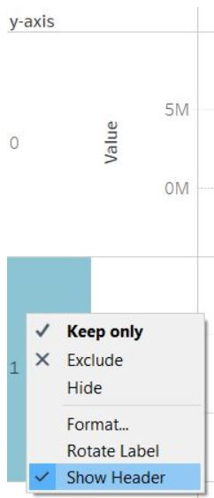

<link rel="stylesheet" type="text/css" media="all" href="style.css"/>

```{r setup, include=FALSE}
knitr::opts_chunk$set(echo = FALSE)
```

# 1. Original Visualisation


### Data Source

The data visualisation above is created by using data provided by Department of Statistics, Singapore (DOS). 

# 2. Critiques

### 2.1 Clarity

i. **Chart title is not aligned with the chart content**- Title reads as "Merchandise Trade of Top Six Trading Countries, 2019-2020". However, chart for Japan only reflects 2020 data.

ii. **Chart axis is misleading**- 
    (a) y-axis scale differs across each country's chart. This makes the charts not comparable at first glance, and will mislead users who do not read the graph in detail.
    (b) Charts have dual y-axis for imports and exports. The scales for imports and exports within each country's chart are not synchronized and hence have different ranges. This makes it difficult to compare whether a country is in net export/ import position. This may also be misleading to users who do not read the graph in detail, as they may assume net export/import position simply by seeing the area under the line.
  
iii. **Chart did not specify criteria for which top 6 trading partners is chosen**- Considerations such as assessed period and criteria being considered (net trade balance/ import/ export or consider each separately) are not specified. Since the selection criteria is not specified in the chart, we cannot make assumptions on the criteria in this Dataviz exercise. Hence, we should avoid mentioning "top six" in the title.

iv. **Presentation may not be the most appropriate depending on what the author is trying to show**- 
    (a) Comparing import and export across time and across countries- since the x-axis and y-axis are not synchronized across each country's chart, users are unable to do a simple comparison of the area under the line across the charts, for each month.
    (b) Comparing net import/ export across time for each country- additional mental subtraction (as scales are not synchronized) and assessment of area under the line required by user to arrive at net export/import for each period.

v. **No commentary provided**- reader does not have commentary to understand the main idea of the visualisation.

vi. **Does not include data source**- reader is unable to verify the data, nor replicate the chart using source data.

vii. **Does not specify measurement currency**- reader will not know if figures for each country is measured in the same currency. This can be included in the axis information.

### 2.2 Aesthetics

i. **Different alignments of x-axis**- charts of various thickness makes the entire visualisation look disorganised. User is also unable to make a meaningful assessment across each country's chart for each time period given that the x-axis is not aligned.

ii. **Chart title vs country name font size**- Font size of title should be larger than the country name as the title will introduce to the user what the chart is about.

iii. **Annotations are not used to convey points**, leaving the reader to infer the purpose of the graph.

iv. **Poor use of colors in the chart**- use of area chart with overlap of colors makes it difficult to read.

v. **No tick marks for y-axis values** even though it's on a continuous scale.

vi. **Legend title has been left as default** (Measure Names), instead of being renamed into something more intuitive and clear to the user.

# 3. Proposed Design

### Sketch


### Advantages of proposed design

### 3.1 Clarity

i. Chart title is aligned with the chart content- chart shows only the relevant periods as aligned with title.

ii. Chart axis is aligned across all 6 countries-
    (a) y-axis scale is aligned across each country's chart.
    (b) Charts have synchronized axis for imports, exports and net exports/imports.
    (c) x-axis width and scale is aligned across each country's chart.

iii. Proposed chart shows exports, imports and net exports/imports across time for each country- users are able to identify trends across time for the three variables. This also reduces the need for users to manually compute the net export/import.
    
iv. Chart title provides audience with the big picture, followed by short commentary to provide more context.

v. Data source is included in chart.

vi. Reference line is added for user to easily identify the demarcation between 2019 and 2020, allowing the user to eyeball the line and bar charts to assess for seasonality effects. Color and line type of reference line is chosen so as to avoid distracting the user.

vii. Measurement currency is specified in the axis so reader will know at one glance.

### 3.2 Aesthetics

i. x-axis is aligned across each country's chart- this makes the visualisation more organised and allows users to compare the trends across time for each country.

ii. Font size for chart title, commentary and chart annotations have been adjusted so as not to divert reader's attention.

ii. Colors are consistent throughout the dashboard with clear legend on what they represent. Minimal overlapping of colors.

iv. Tick marks added to y-axis scale. Soft gridlines have also been added to the chart to provide reference but not to distract users.

v. Annotations added to convey points, which includes computation of year-on-year difference in export and imports. This allows users to see at a glance, the trending for exports/ imports.

vi. Default legend title has been renamed to be more representative and clear to the user.

# 4. Final Visualisation

### 4.1 Snapshot of dashboard


# 5. Data Visualisation Steps

1. After downloading the data, select data for the relevant countries from each dataset (import and export dataset) and paste into a new sheet using Microsoft Excel.


2. Transpose the extracted import and export data, naming the date column as "Date" and value column as "Imports" or "Exports".

{width=50%}

3. Combine the transposed import and export data.

{width=50%}

4. Perform the following actions and save the manipulated data set as "data_clean".

No  |Variable     | Action                                  |
----|-------------| ----------------------------------------|
1   |Variables    | Rename column as "Country"              |
2   |Variables    | Removed "(Thousand Dollars)" from value |
3   |Imports      | Rename column as "Imports (S\$'000)"    |
4   |Exports      | Rename column as "Exports (S\$'000)"    |

{width=50%}

5. Import the data into Tableau.

{width=50%}

6. Change data type- change Date data type to “Date”.<br/>
Remove (\$'000) from [Exports(\$'000)] and [Imports(\$'000)] as we will be indicating this in the axis information later.

{width=65%}

7. As we will be presenting the charts for six countries in the form of a trellis, we have to create two calculated fields called "x-axis" and "y-axis".
    (a) Create a new calculated field and name it "x-axis", with the below formula (Figure 11).
    (b) Create another calculated field named "y-axis", with the below formula (Figure 12).

{width=50%}

{width=75%}

{width=75%}

8. Drag [Date] to columns and change selection to month. Change data type to continuous.

{width=50%}

9. Drag [Exports(\$'000)] to rows, then drag [Imports(\$'000)] and drop it into the chart as seen in Figure 14 below. This creates a Measure Values shelf that appears in the data pane and contains all the measures of the data collected into one field. 

{width=50%}

10. Drag the calculated fields [x-axis] and [y-axis] to Columns and Rows respectively. Convert both fields into discrete fields.

{width=75%}

11. Drag [Country] into the Marks card under detail.

{width=35%}

12. Edit table calculation for both [x-axis] and [y-axis] calculated fields. Select computation using Specific Dimensions- by [Country] then by [Month of Date], at the level of [Country].

{width=35%}

13. Create another calculated field named [Net exports/imports], with the below formula.

{width=75%}

14. Drag [Net exports/imports] into Rows and select dual axis. Right click on the axis and select synchronize axis (Figure 19).

{width=75%}

15. On the Marks card for [net exports/imports], click the Mark Type drop-down and select bar.

{width=30%}

16. Drag [net exports/imports] to Color on the Marks card. On the Marks card, click Color > Edit Colors.
    (a) Update stepped color option to 2 steps as we want to show negative and positive values in different colors.
    (b) Click on the drop down under palette and select the red-green diverging option (Figure 21).
    (c) Adjust the slider under opacity to 50% (Figure 22).

{width=65%}

{width=35%}

17. Hide the below axis headers and field labels by deselecting Show Header and selecting hide field labels respectively.

{width=80%}

{width=25%}

{width=80%}

18. Now that we have created the trellis, we will move on to add labels to each panel. We want to show the % change in exports and imports year-on-year. Hence we will create four new calculated fields, [Sum Export Y-O-Y], [Sum Import Y-O-Y], [Export Diff Calculation], [Import Diff Calculation]. Formulas are shown below:

{width=75%}

{width=75%}

{width=75%}

{width=75%}

19. Drag [Export Diff Calculation] and [Import Diff Calculation] into the Measure Values Marks card and drop it into Label. This will label the [Exports] and [Imports] line graph within each panel in the trellis. Click on Label and select Line Ends option, so labels will appear at the end of the line graph, to avoid cluttering the graph with labels.


20. As we only need one label instead of two as seen in Figure 30 above, we will proceed to right click on the import line graph label and select Mark Label > Never Show. Now we are left with one label for each panel. Align the label to top right corner of each panel.


21. Next, we want to add a label to indicate which country each panel is representing. Drag [Country] into the Sum(Net exports/imports] Marks card, under Label. Click on Label and select Most Recent option, so labels will appear at the end of the bar chart, to avoid cluttering the graph with labels. Move the label to the top left of each panel and bold it to make it more visible to users.


22. Next, we will amend the y-axis. Right click on y-axis and select Edit Axis. We will edit the y-axis for the following:
    (a) Under the General pane, update range. Select radio button for fixed and amend start and end to -3,000,000 and 8,500,000 respectively.
    (b) Update Title under Axis Titles to "Singapore Dollars ($'000)".
    (c) Under the Tick Marks pane, select radio button for fixed and amend Tick Interval to 2,000,000. 
    
{width=50%}

{width=50%}

23. Next, we will amend the x-axis. Right click on x-axis and select Edit Axis. We will edit the x-axis for the following:
    (a) Under the General pane, update range. Select radio button for fixed and amend start and end to 1/12/2018 and 31/1/2021 respectively. This is to provide a small gap at the start and end of each trellis panel. Next, uncheck Show times.
    (b) Update Title under Axis Titles to "Month".
    (c) Under the Tick Marks pane, select radio button for fixed and amend Tick origin to begin at 1/1/2019, and Tick Interval to 6 months. 
    
{width=50%}

{width=50%}

24. Update the Legend Title by clicking on the small drop down arrow on the legend pane and selecting Edit Title.

No  |Original Title           | Updated Title
----|-------------------------|-------------------------------------
1   |Measure Names            | Trade Type
2   |Sum(Net Exports/Imports) | Net Exports/Imports

{width=75%}

{width=75%}

25. Create two calculated fields [Net export position] and [Net import position], with the formulas shown in Figure 39 and Figure 40 respectively. Drag these two fields into the Sum(Net exports/imports) Marks card under Tooltip.

{width=75%}

{width=75%}

Click on Tooltip > Insert the above calculated fields under Net exports/imports and color <AGG(Net export position)> and <AGG(Net import position)> green and red respectively (Figure 41). Edit Tooltip in the Measure Values Marks card (Figure 42).

{width=75%}

{width=75%}

26. Align fonts used in graph to Tableau Light. Adjust size of labels and legends to font size 9.

27. Sort trellis by [Exports(\$'000)]. Under Measure Values Marks card, Select [Country] > Sort > Sort by Field > Descending order > Input Field Name as "Exports(\$'000)" > Select Sum under Aggregation. This sorts the trellis panel by exports across the six countries. 

{width=65%}

28. Add commentary: "Exports to the six trading partners have increased 2.0%, while imports have reduced 2.8%. There does not appear to be a seasonality effect for both exports and imports." Apply bold effect to the percentages to accentuate them.

29. Add reference line to the x-axis. Right click on x-axis > select scope as Per Pane > change value type to constant and choose 1 Jan 2020 > Change Label to none and Tooltip to automatic. We also update the reference line formatting by selecting a thinner, dotted line and grey color, so as to differentiate it from the other gridlines in the chart.<br/>
The reference line allows users to better segregate between both years, for each panel.

{width=65%}

### 5.1 Dashboard

1. Add sheets into dashboard- Drag the "Singapore's Trade with 6 countries" sheet into the dashboard.

2. Add dashboard title- Using Objects > Text > drag to top of dashboard.<br/>
Add title: "Singapore's Merchandise Trade with Six Trading Countries, 2019-2020".<br/>
Adjust the title to be aligned in the middle. Click on title and select the Layout tab > Background > select a grey background and white font for the dashboard title so that the title stands out from the rest of the graph.

3. Add source- Using Objects > Text > drag to bottom of dashboard and add:<br/>
Source: Department of Statistics, Singapore (DOS)         (https://www.singstat.gov.sg/)<br/>
The raw data: https://www.singstat.gov.sg/find-data/search-by-theme/trade-and-investment/merchandise-trade/latest-data
  
4. Add author- Using Objects > Text > drag to bottom right of dashboard and add:<br/>
Dataviz Makeover 1| Stella Loh
  
# 6. Observations

1. There does not appear to be a seasonality pattern in the exports and imports across both years (2019 and 2020), across the six countries. 

2. Hong Kong and Taiwan have remained consistently in the net export and net import position respectively. 

3. Singapore's net trade with Malaysia is becoming increasing negative (net import position) in 2020, as compared to 2019. This is mainly due to declining exports to Malaysia. Exports have reduced 18.2% Y-O-Y while imports have increased 1.2% Y-O-Y.

4. Conversely, Singapore's net trade with United States is becoming increasing positive (net export position) in 2020, as compared to 2019. This is mainly due to increasing exports to United States. Exports have increased 19.3% Y-O-Y while imports have reduced 19.0% Y-O-Y, making Singapore a net exporter for most of 2020.

5. Imports from Hong Kong are significantly lower than the other five countries.

6. Exports and imports to/ from Japan remain relatively stable over both years. Both exports and imports with Japan are relatively close and hence the net export or import position is small.
