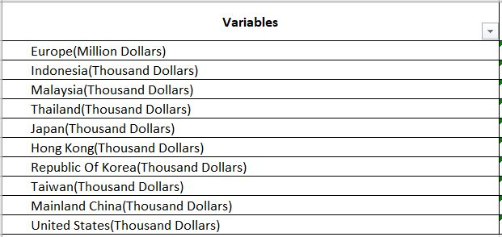
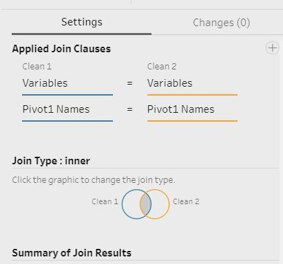
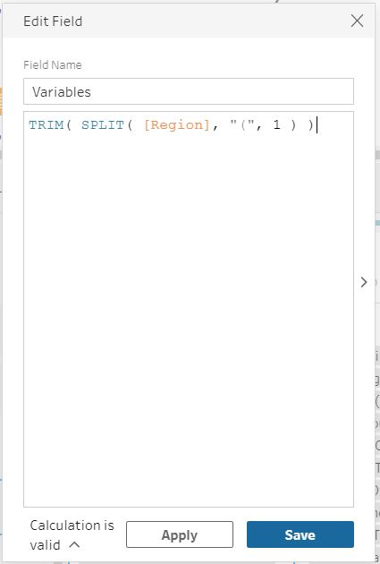
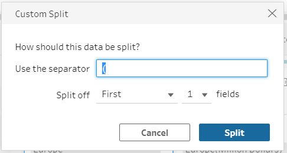
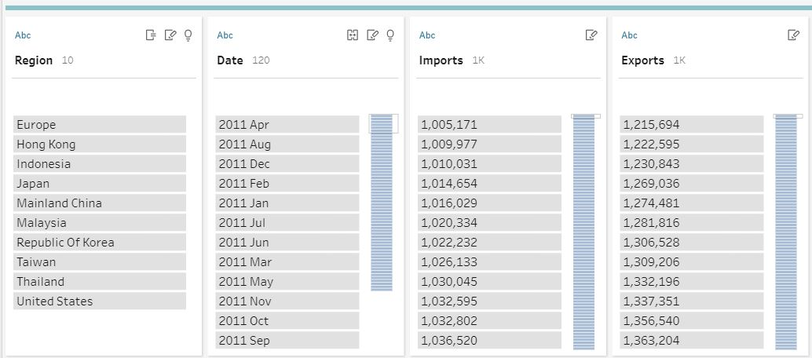
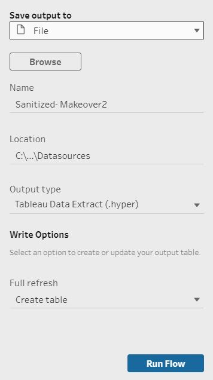
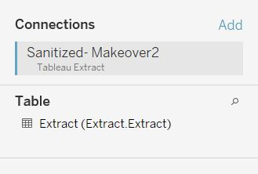

<style>

body{
  background-color: #F5F5F5;
}
</style>

```{r setup, include=FALSE}
knitr::opts_chunk$set(echo = FALSE)
```

# 1. Original Visualisation


### Data Source

The data visualization above is created by using data provided by Department of Statistics, Singapore (DOS). 

# 2. Critiques
### 2.1 Clarity

i. **No title** provided at the top for reader to understand the main idea of the visualization.

ii. **Chart did not indicate which period range** the figures are derived from.

iii. **Poor placement of commentary**- The “I” section acts as a commentary to provide users on the context of the chart and what it is trying to show and hence placement should be below the title and before the main visualization so that the user will read this section first before looking at the chart.In this case, the user will only see this commentary after seeing the main visualization.

iv. In this case, chart is a static chart hence user is unable to see the trending of exports, imports and net exports/ imports. There is no indication of which year this chart is representing, as well as historical information to show when Singapore’s trade with China and US has become net exporter and net importer respectively. Hence we are **unable to align what we have read in the “I” section with what is shown in the graph.**
  
iv. The data source has a note included which **lists the countries which are included under the EU category**. This was not included as a note in the chart for the user's clarity.

v. **Labeling of the axis is not clear.** “Export” label is written underneath the y-axis (which represents imports) and "Import" label is written to the left of the x-axis (which represents exports).

vi. **Users will not know at first glance which country has the largest net trade balance.** They are able to compare export and import figures using their position on the x and y axis but not net trade, which requires some mental calculation.

vii. **Chart did not specify what the labels are referring to**- if they are referring to exports/ imports or total merchandise trade.

### 2.2 Aesthetics

i. **Axis does not contain information on what currency this is measured in** and must be read off the labels. This can be included in the axis information.

ii. Chart uses labels instead of legends to show which color is representative of each country. However, due to the size of each different colored circle and the addition of labels, the **chart looks cluttered**. 

iii. **Chart uses a note (instead of a legend) at the bottom to indicate that size of the bubbles is indicative of total merchandise trade value with the trading partner**. This makes it less intuitive as the user is not able to decipher that at first glance and hence has to read on to understand what the size of the bubble represents.

iv. **The labels block essential information.** For example, the label for United States is blocking the user from seeing the center point of the Taiwan bubble which is supposed to show if the country is a net exporter or importer, especially since the bubble falls close to the cutoff line between net exporter and importer.

v. **Size of the bubbles are too big and opacity is not adjusted for overlaps** and hence creates overlap, obscuring information and clutters the chart. Most of the bubbles overlap but the opacity of the bubbles is not adjusted. This makes it difficult to read the chart. For example, for Republic of Korea, we are unable to see the center point of the circle which is supposed to show if the country is a net exporter or importer, especially since the bubble falls close to the cutoff line between net exporter and importer. Same issue for EU and Malaysia. The size of the bubbles can also be reduced to reduce chart clutter.

vi. **There is poor use of colors in the chart.** Other than colors being used to differentiate region, background colors use another set of colors and is not particularly useful as it does not seem to serve any additional purpose. A reference line is sufficient to demarcate the cutoff between net exporters and importers.

vii. **Too many symbols are used in this chart, and they look similar which may also confuse the user.** For example, the top net exporter and importer are each given a symbol and annotated next to the country’s bubble in the chart. This **adds on to the clutter of colors and shapes we already see in the chart.** Furthermore, exports and imports are given yet another set of symbols which have similar colors to top net exporters and importers respectively. Only minor differences are noted between each set of symbols. There is no need to have symbols for exports and imports as they do not serve any purpose and the user is better off simply reading the axis labels.


# 3. Proposed Design

### Sketch


### Advantages of proposed design

### 3.1 Clarity
### 3.2 Aesthetics
# 4. Final Visualisation

### 4.1 Snapshot of dashboard


# 5. Data Visualisation Steps

### Tableau Prep

1. After downloading the data, select data for the relevant countries from each dataset (import and export dataset) and paste into a new sheet using Microsoft Excel.



2. Open Tableau Prep and connect the file to Tableau Prep. Drag the relevant sheets onto the main pane. 


3. Click on + to add the next step. Select the pivot option and drag the period columns into the pivot fields pane. Period columns refer to those columns represented by "2011 Jan" through "2020 Dec". This step is to tell Tableau Prep which fields should be pivoted.


4. Click on + to add the next step. Next, we will join both datasets using the join function, with the below join clauses (Figure 7). The flow should now look similar to Figure 8.




6. Next, add a clean step. We will now make the following changes to the joined dataset. 
    - Merge the two columns named "Variables" and "Variables-1" into one column as they represent the same information. Drag “Variables-1” into “Variables”.
    - Merge the two columns named "Pivot1 Names" and "Pivot1 Names-1" into one column as they represent the same information. Drag “Pivot1 Names-1” into “Pivot1 Names”.
    - Rename “Pivot1 Values-1” and “Pivot1 Values” into “Imports” and “Exports” respectively.
    - Trim the "Variables" column to remove unnecessary spaces, using the formula seen in Figure 9. Right click on the "variables" column title > select clean > select Trim Spaces.
    - Split “Variables” column using “(“ as separator. Right click on the "variables" column title > select Split Values > select Custom Split. Enter “(“ into the "Use as separator" selection and retain the original selection under Split off field selection (Figure 10). Click on the split button. After splitting, remove the original column ("Variables") and rename the newly split column as “Region”.
    - Rename “Pivot1 Names-1” column into “Date”.
The current dataset should look similar to Figure 11. 
    




7. Click on + to add the next step. Select the Clean option and make the following amendments to the dataset.
    - Update the variable datatypes:
        - Exports and Imports- from String to Number decimal type
        - Date- from String to Date type
    - Create two new calculated fields and name them “Imports Aligned” and “Exports Aligned”. This is to align the denomination of Europe (presented in millions) with the other regions (in thousands). The formulas should be as shown in Figure 12 (Imports Aligned) and Figure 13 (Exports Aligned) below.
    - Remove the original "Exports" and "Imports" columns.


8. Click on + to add the next step. Select the Output option. We will save the results in Tableau Data Extract format (.hyper). Select this format under “Output Type” and update the Name and Location of this saved file if need be. Leave the other options as default selections. See Figure 12 for the selections made. Once finalized, click Run Flow.



9. Save the Tableau Flow File by selecting File> Save As> Input Name of file and location to save in. This is so that we can refer back to this Tableau Prep Flow File if we need to make any amendments.

### Tableau Desktop

1. Open Tableau Data Extract file saved previously. This should open up Tableau Desktop directly. The connections and extract table should already have been added in the file. Tableau Prep outputs Hyper files, and can publish data sources to Tableau Server or Tableau Online, connected to from Tableau Desktop. The Data Source tab should look like Figure 13 below (Tableau Extract file name will differ depending on what you have named the file).



2.
