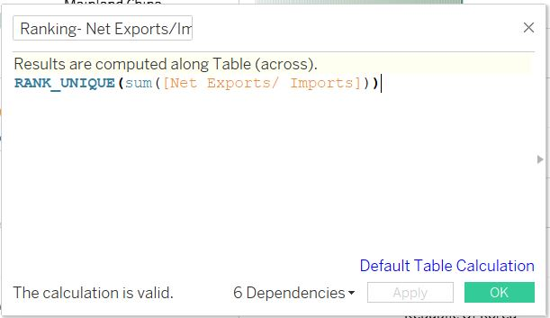
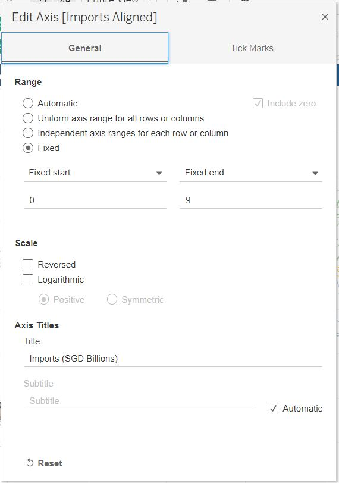
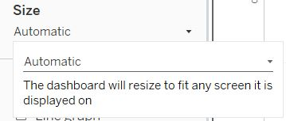
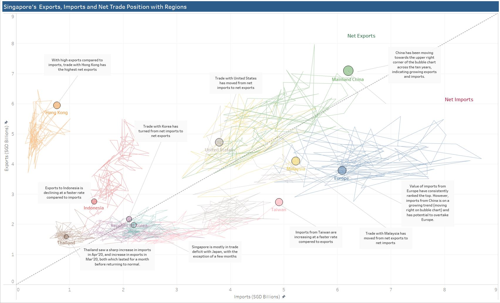
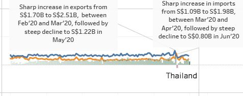

<style>

body{
  background-color: #EBEDEF;
  font-family:helvetica;
}
</style>

```{r setup, include=FALSE}
knitr::opts_chunk$set(echo = FALSE)
```

# 1. Original Visualization

{width=85%}

### Data Source

The data visualization above is created using data provided by [Department of Statistics, Singapore (DOS)](https://www.singstat.gov.sg/modules/infographics/singapore-international-trade). 

# 2. Critiques
### 2.1 Clarity

i. Chart title refers to 2020 trade figures but commentary under the "I" note mentioned of years 2006 and 2009. Hence the **user is unable to align what is in the commentary to title of the chart**.

ii. In this case, chart does not show trending of exports, imports and net exports/ imports, as well as historical information to show when Singapore’s trade with China and US has become net exporter and net importer respectively. Hence we are **unable to align what we have read in the “I” section with what is shown in the graph.**

iii. **Poor placement of commentary**- The “I” section acts as a commentary to provide users on the context of the chart and what it is trying to show and hence placement should be below the title and before the main visualization so that the user will read this section first before looking at the chart. In this case, the user will only see this commentary after seeing the main visualization.

iv. **The size of the bubble is not proportional to the total merchandise trade balances they represent.** The “Lie Factor” is a value to describe the relation between the size of effect shown in a graphic and the size of effect shown in the data. Edward Tufte, Prof. at the Yale University, defined the “Lie Factor” in his book “The Visual Display of Quantitative Information” in 1983. This results in the below formula: $$\ Lie Factor = \frac{size of effect shown in graphic}{size of effect in data}$$
<br>
To ensure the integrity of a graphic, its Lie Factor should have a value between 0.95 and 1.05. If the value is less or greater, it indicates a substantial (and often intended) distortion, far beyond minor inaccuracies (e.g. caused by plotting).
<br>
In this case, comparing the size of the bubble for Mainland China and United States, we have arrived at the following computations. Total merchandise trade for Mainland China and United States in 2020 is S\$136.2 billion and S\$102.4 billion respectively. Hence total merchandise trade for Mainland China is about 33.01% higher than United States:$$\ Size of effect in data = \frac{136.2 - 102.4}{102.4} * 100 = 33.01\%$$
<br>
Comparing the dimensions of the bubble representing the regions, United State's bubble has a diameter of 4.6cm while Mainland China has a diameter of 6.2cm. Hence using the formula for calculation of circle area, area of China's bubble is 81.66% bigger than United States:$$\ Size of effect shown in graphic = \frac{3.1^2 - 2.3^2}{2.3^2} * 100 = 81.66\%$$
<br>
Hence, the lie factor is:$$\ Lie Factor = \frac{81.66}{33.01} = 2.47$$
<br>
The graphic has overstated differences by 247%. Users may thus get misled by the proportion of the bubble sizes represented in the chart, violating graphical integrity.
<br>
We have observed that the author seems to have presented the numbers proportional to diameter instead of area of the circle.$$\ Radius of United States bubble (diameter proportional) = {3.1*(\frac{102.4}{136.2})}= 2.33$$ 
<br>
This is incorrect and results in quadrupling of the circle area. To achieve accurate representation, the radius of United States bubble should be:$$\ Radius = \sqrt{\frac{102.4}{136.2}} * 3.1 = 2.69$$

iv. The data source has a note included which **lists the countries which are included under the EU category**. This was not included as a note in the chart for the user's clarity.

v. **Labeling of the axis is not clear.** “Export” label is written underneath the y-axis (which represents imports) and "Import" label is written to the left of the x-axis (which represents exports).

vi. **Chart did not specify what the labels are referring to**- if they are referring to exports/ imports or total merchandise trade.

vii. **Chart uses a note (instead of a legend) at the bottom to indicate that size of the bubbles is indicative of total merchandise trade value with the trading partner**. This makes it less intuitive as the user is not able to decipher that at first glance and hence has to read on to understand what the size of the bubble represents.

viii. Perceptions of area versus magnitude can vary per person. **The perceived area of a circle grows more slowly than the actual**. Hence using two dimensional objects (area of circle) to represent scalars (total merchandise trade in this case) is naturally misleading.

### 2.2 Aesthetics

i. **Axis does not contain information on what currency this is measured in** and must be read off the labels. This can be included in the axis information.

ii. Chart uses labels instead of legends to show which color is representative of each region. However, due to the size of each different colored circle and the addition of labels, the **chart looks cluttered**. 

iii. **The labels overlap other marks.** For example, the label for United States is blocking the user from seeing the center point of the Taiwan bubble and the Europe label also overlaps with the Malaysia bubble.

iv. **Size of the bubbles are too big and opacity is not adjusted for overlaps** and hence creates overlap, obscuring information and clutters the chart. Most of the bubbles overlap but the opacity of the bubbles is not adjusted. This makes it difficult to read the chart. For example, for Republic of Korea, we are unable to see the center point of the circle which is supposed to show if the region is a net exporter or importer, especially since the bubble falls close to the cutoff line between net exporter and importer. Same issue for EU and Malaysia. The size of the bubbles can also be reduced and made less opaque to reduce chart clutter.

v. **There is poor use of colors in the chart.** Other than colors being used to differentiate region, background colors use another set of colors and is not particularly useful as it does not seem to serve any additional purpose. A reference line is sufficient to demarcate the cutoff between net exporters and importers.

vi. **Too many symbols are used in this chart, and they look similar which may also confuse the user.** For example, the top net exporter and importer are each given a symbol and annotated next to the region’s bubble in the chart. This **adds on to the clutter of colors and shapes we already see in the chart.** Furthermore, exports and imports are given yet another set of symbols which have similar colors to top net exporters and importers respectively. Only minor differences are noted between each set of symbols. There is no need to have symbols for exports and imports as they do not serve any purpose and the user is better off simply reading the axis labels.

vii. Due to the size of the bubbles and labels, the chart looks cluttered. **Some of the labels (Mainland China and Hong Kong) fall outside the main chart pane**.

viii. Interactivity of the chart is added to provide additional clarity due to the overlapping bubbles and **do not provide any additional information**.

# 3. Proposed Design

### Sketch


### Advantages of proposed design

### 3.1 Clarity

i. Title added at the top for reader to understand the main idea of the visualization.

ii. Title of dashboard indicates periods that the figures are derived from. Also, interactivity is added so that user is able to toggle and adjust the date that they wish to see.

iii. Commentary is added right below title to provide users on the context of the chart. Commentary also refers to the same period as what is reflected in the charts (2011-2020), hence allowing users to align the commentary with the charts.
  
iv. Included note which states the countries which are included under the EU category. This is important as EU is not a country and instead consists of several countries under this categorization.

v. Axis are clearly labeled without the need to use symbols. Top Net Exporter and Top Net Importer for each period is also indicated in the interactive tooltip functions, without the use of symbols as in the original visualization, hence reducing clutter.

vi. Instead of using labels which may cause clutter in the chart, we have used the interactive tooltip function to provide additional details on Import, Export, Net Trade and even Ranking of the regions.

vii. Legend is used to indicate that size of the bubble is indicative of total merchandise trade value with the trading partner. This makes it more intuitive as the user is able to decipher straightaway what the size of the bubble represents.

viii. The area of the bubbles have been adjusted to be approximately proportional to the total merchandise trade balances they represent. We have also added additional details via tooltips where users can hover over the bubble to get the exact total merchandise trade balance instead of relying solely on the size of the bubbles.

### 3.2 Aesthetics

i. Axis contains all information on denomination of the figures- both SGD and that the figures are denominated in billions.

ii. Size of labels have been reduced and is presented in plain string form (instead of in a box like original visualization). This reduces space taken up. Labels are also presented in the same color as the bubbles for alignment. This resolves the issue in the original visualization where the labels block essential information. Labels are also contained within the main chart pane.

iii. Size of bubbles has been adjusted smaller and opacity is adjusted to 50% to accommodate overlaps. Users will still be able to decipher essential information should the bubbles overlap. Black border has also been added to the bubbles to highlight the borders. These adjustments makes it easier to read the chart and reduce chart clutter.

iv. Proposed visualization has removed the background colors as they not particularly useful and does not serve any additional purpose. A reference line and annotations have been added to demarcate the cutoff between net exports and net imports.

v. Proposed visualization has removed the top net exporter and importer symbols used in the original visualization with interactive functions instead. User can hover over each country to see the net trade ranking for that period. This reduces the clutter of symbols we see in the original visualization.

# 4. Final Visualisation

### 4.1 Snapshot of dashboard


# 5. Data Visualisation Steps

### Tableau Prep

1. After downloading the data, select data for the relevant regions from each dataset (import and export dataset) and paste into 2 new sheets (one for export and the other for import) using Microsoft Excel. Save the file.


2. Open Tableau Prep and connect the file to Tableau Prep. Drag the relevant sheets onto the main pane. 


3. Click on + to add the next step. Select the pivot option and drag the period columns into the pivot fields pane. Period columns refer to those columns represented by "2011 Jan" through "2020 Dec". This step is to tell Tableau Prep which fields should be pivoted.


4. Click on + to add the next step. Next, we will join both datasets using the join function, with the below join clauses (Figure 7). The flow should now look similar to Figure 8.

{width=75%}


5. Next, add a clean step. We will now make the following changes to the joined dataset. 
    - Merge the two columns named "Variables" and "Variables-1" into one column as they represent the same information. Drag “Variables-1” into “Variables”.
    - Merge the two columns named "Pivot1 Names" and "Pivot1 Names-1" into one column as they represent the same information. Drag “Pivot1 Names-1” into “Pivot1 Names”.
    - Rename “Pivot1 Values-1” and “Pivot1 Values” into “Imports” and “Exports” respectively.
    - Trim the "Variables" column to remove unnecessary spaces. Right click on the "Variables" column title > select clean > select Trim Spaces.
    - Split “Variables” column using “(“ as separator. Right click on the "Variables" column title > select Split Values > select Custom Split. Enter “(“ into the "Use the separator" selection and retain the original selection under Split off field selection (Figure 9). Click on the split button. After splitting, remove the original column ("Variables") and rename the newly split column as “Region”.
    - Rename “Pivot1 Names-1” column into “Date”.
The current dataset should look similar to Figure 10. 

{width=60%}


6. Click on + to add the next step. Select the Clean option and make the following amendments to the dataset.
    - Update the variable datatypes:
        - Exports and Imports- from String to Number decimal type
        - Date- from String to Date type
    - Create two new calculated fields and name them “Imports Aligned” and “Export Aligned”. This is to align the denomination of Europe (presented in millions) with the other regions (in thousands). The formulas should be as shown in Figure 11 (Imports Aligned) and Figure 12 (Export Aligned) below.
    - Remove the original "Exports" and "Imports" columns.


7. Click on + to add the next step. Select the Output option. We will save the results in Tableau Data Extract format (.hyper). Select this format under “Output Type” and update the Name and Location. Leave the other options as default selections. See Figure 13 for the selections made. Once finalized, click Run Flow.

{width=30%}

8. Save the Tableau Flow File by selecting File> Save As> Input Name of file and location to save in. This is so that we can refer back to this Tableau Prep Flow File if we need to make any amendments.

### Tableau Desktop

*Line graph*

1. Open Tableau Data Extract file saved previously. This should open up Tableau Desktop directly. The connections and extract table should already have been added in the file. Tableau Prep outputs Hyper files, and can publish data sources to Tableau Server or Tableau Online, connected to from Tableau Desktop. The Data Source tab should look like Figure 14 below (Tableau Extract file name will differ depending on what you have named the file).

{width=50%}

2. Create a new sheet. As we will be presenting the charts for ten regions in the form of a trellis, we have to create two calculated fields called “x-axis” and “y-axis”.
    a. Create a new calculated field and name it “x-axis”, with the below formula (Figure 15).
    b. Create another calculated field named “y-axis”, with the below formula (Figure 16).
    
{width=75%}

{width=75%}

3. Drag [Date] to columns and change selection to month. Change data type to continuous.

{width=75%}

4. Drag [Export Aligned] to rows, then drag [Imports Aligned] and drop it into the chart as seen in Figure 18 below. This creates a Measure Values shelf that appears in the data pane and contains all the measures of the data collected into one field.


5. Drag the calculated fields [x-axis] and [y-axis] to Columns and Rows respectively. Convert both fields into discrete fields.


6. Drag [Region] into the Marks card under detail.

{width=30%}

7. Click on the small arrow next to [x-axis] in Columns. Select Edit table calculation > select computation using Specific Dimensions- by [Region] then by [Month of Date], at the level of [Region]. Do the same for [y-axis] in Rows.

{width=30%}

8. Create another calculated field named [Net Exports/Imports], with the below formula.

{width=75%}

9. Drag [Net Exports/Imports] into Rows and select dual axis by clicking on the small arrow next to the field name. We will then synchronize the axis by right clicking on the axis and select synchronize axis (Figure 23).


10. On the Marks card for [Net Exports/Imports], click the Mark Type drop-down and select bar.

{width=30%}

11. Drag [Net Exports/Imports] to Color on the Sum(Net Exports/ Imports) Marks card. On the Marks card, click Color > Edit Colors.
    a. Update stepped color option to 2 steps as we want to show negative and positive values in different colors (Figure 25).
    b. Click on the drop down under palette and select the red-green diverging option (Figure 25). Click ok.
    c. Adjust the slider under opacity to 50% (Figure 26).
    
{width=60%}

{width=30%}

12. Hide the below axis headers and field labels by deselecting Show Header and selecting hide field labels respectively.


{width=40%}

13. Next, we want to add a label to indicate which region each panel is representing. Drag [Region] into the Sum(Net Exports/Imports) Marks card, under Label. Click on Label and select Most Recent option, so labels will appear at the end of the bar chart, to avoid cluttering the graph with labels.

{width=30%}

14. Drag [Date] into the Pages pane and select Month format by clicking on the arrow next to Date.

{width=30%}

15. Update the Measure Values Marks Card and change Mark Type to Circle instead of Automatic.

{width=20%}

16. On the animation window that appears on the right of the sheet (below Measure Names), tick on Show history option and click on the arrow next to Show history. Make the following selections:
    a. Marks to show history for: Change to All
    b. Show: Both
    c. Under Format in Trails section: Click on dropdown and select the second thinnest line option (Figure 35)
    
{width=30%}

{width=30%}


17. Next, we will amend the y-axis. Right click on y-axis and select Edit Axis. We will edit the y-axis for the following:
    a. Under the General pane, update range. Select radio button for fixed and amend start and end to -5 and 10 respectively.
    b. Update Title under Axis Titles to “SGD (Billions)”.
    b. Under the Tick Marks pane, select radio button for fixed and amend Tick Interval to 5.
    
{width=75%}

{width=75%}

18. Next, we will amend the x-axis. Right click on x-axis and select Edit Axis. We will edit the x-axis for the following:
    a. Under the General pane, update range. Select radio button for fixed and amend start and end to 1/7/2010 and 30/6/2021 respectively. This is to provide a small gap at the start and end of each trellis panel. Next, uncheck Show times.
    b. Update Title under Axis Titles to “Month”.
    c. Under the Tick Marks pane, select radio button for fixed and amend Tick origin to begin at 1/1/2011, and Tick Interval to 2 years.
    
{width=75%}

{width=75%}    

19. Update the Legend Title by clicking on the small drop down arrow on the legend pane and selecting Edit Title.

{width=75%}

{width=75%}

{width=75%}

20. Create two calculated fields [Net Export position] and [Net Import position], with the formulas shown in Figure 43 and Figure 44 respectively. Drag these two fields into the Sum(Net Exports/Imports) Marks card under Tooltip.

{width=75%}

{width=75%}

Create another new calculated field [Ranking- Net Exports/Imports] with the formula shown in Figure 45 below. Drag the field into the Sum(Net Exports/Imports) Marks card under Tooltip. 

{width=75%}

Click on Tooltip > Insert the <AGG(Net Export position)> and <AGG(Net Import position)> under Net Exports/Imports and color them green and red respectively (Figure 46). Create a new section called Net Trade Ranking and insert the <AGG(Ranking)> value. Align the other tooltip fields to Figure 46 below. Edit Tooltip in the Measure Values Marks card to align with Figure 47.

{width=75%}

{width=75%}

21. Click on arrow next to Ranking- Net Exports/Imports > Compute Using > Select Region.

{width=75%}

22. Align fonts used in graph to Tableau Light. Adjust size of labels and legends to font size 9. Right click on the main chart pane > select format. In the sheets tab, adjust all fonts to Tableau Light.

23. Sort trellis by [Exports Aligned]. Under Measure Values Marks card, select [Region] > Sort > Sort by Field > Descending order > Input Field Name as “Export Aligned” > Select Sum under Aggregation. This sorts the trellis panel by exports across the ten regions.

{width=50%}

24. Right click on the main chart pane > select format > click on the arrow next to Fields and select the Sum (Export Aligned). Under the Pane tab, under Default section, click on the dropdown next to Numbers and select Number (Custom), then update Decimal Places to 2. Do this for Sum (Imports Aligned), Sum (Net Exports/ Imports), AGG(Net Export position) and AGG(Net Import position) too. This is to align all tooltips to 2 decimal places.

{width=80%}

25. Next, we will editing the alias of the color legend. Right click on Export Aligned in the Trade Type legend > select Edit Alias > Rename as Exports. Do the same for Imports Aligned and rename as Imports.

{width=30%}

26. Add Title: “Singapore's  Exports, Imports and Net Trade Position with Regions, 2011-2020”. Apply bolding, change font size to 12 and font to Tableau Light. Change font color to white. Right click on title pane > select Format Title > Under Title section, select blue next to Shading.

{width=30%}

27. Under Measure Values Marks card, click on Size and drag the slider all the way to the left.

{width=30%}

*Bar Chart*

28. Create two new calculated fields named [Running Total: Total Merchandise Trade] and [Ranking], with the below formulas.

{width=75%}

{width=75%}

29. Drag [Date] into the Pages pane. Select MMM YYYY format for [Date]. Next, drag [Running Total: Total Merchandise Trade] into the Columns and click on arrow next to [Running Total: Total Merchandise Trade] > Edit Table Calculation > select Compute Using Specific Dimensions > Tick on the box next to Month of Date.

{width=30%} 

30. Drop [Region] into Marks card under Detail. 

{width=60%}.

31. Next, drag [Ranking] into Rows. Click on arrow next to [Ranking] and select discrete. Next, click on arrow next to [Ranking] > Edit Table Calculation > select Compute Using Specific Dimensions > Tick on the box next to Region.

{width=30%} 

32. Drag [Region] into Marks card and drop it under Label and Color. Click on color and adjust opacity to 50%.

{width=30%}

{width=30%}


33. Next, we will amend the x-axis. Right click on x-axis and select Edit Axis. We will edit the x-axis for the following:
    a. Under the General pane, update range. Select radio button for fixed and amend start and end 0 and 1400 respectively.
    b. Update Title under Axis Titles to “Total Merchandise Trade (SGD Billions)”.
    c. Under the Tick Marks pane, select radio button for fixed and amend Tick origin to begin at 0, and Tick Interval to 100.
    
{width=75%}

{width=75%}

34. Update the Legend Title by clicking on the small drop down arrow on the legend pane and selecting Edit Title. We will also hide the Region card given that we have already included Region as labels in the main bar chart. Click on the arrow next to legend title > select Hide Card (Figure 64).

{width=75%}

{width=40%}

35. Click on Label under Marks card. Select Most Recent under Marks to Label section. Tick the checkbox next to Allow labels to overlap other marks under Options section,

{width=60%}

36. Align fonts used in graph to Tableau Light. Adjust size of labels and legends to font size 9. Right click on the main chart pane > select format. In the sheets tab, adjust all fonts to Tableau Light.

37. Click on Tooltip and update the tooltip fields to Figure 66 below.

{width=70%}

38. Right click on the main chart pane > select format > click on the arrow next to Fields and select AGG(Running Total: Total Merchandise Trade). Under the Pane tab, under Default section, click on the dropdown next to Numbers and select Number (Custom), then update Decimal Places to 2. This is to align all tooltips to 2 decimal places.

{width=60%}

39. Add Title: “Ranking of Singapore's Cumulative Merchandise Trade with Regions, 2011-2020”. Apply bolding, change font size to 12 and font to Tableau Light. Change font color to white. Right click on title pane > select Format Title > Under Title section, select blue next to Shading.

{width=30%}

*Bubble chart*

40. Drag [Imports Aligned] and [Export Aligned] into Columns and Rows respectively.

41. Drag [Region] into the Marks card and drop it under Color.

42. Create a new calculated field named [Total Merchandise Trade], with the below formula (Figure 69). 

{width=75%} 

43. Drag [Export Aligned] into Columns. Right click on arrow next to field name and select Dual Axis. Synchronize the axis.


44. Remove Measure Names and Sum(Total Merchandise Trade) from the All Marks card. Navigate to the Sum (Export Aligned) Marks card. Click on Size > Adjust the slider all the way to the left. Click on Color > Change Opacity to 0%.

{width=30%}

{width=30%}

45. Right click on the Bubble Chart > Select Trend Lines > Show Trend Lines > Sum(Export Aligned).

{width=75%}

46. Drag [Date] into the Pages pane and select Month format by clicking on the arrow next to Date.

{width=30%}

47. Next, we will amend the y-axis. Right click on y-axis and select Edit Axis. We will edit the y-axis for the following:
    a. Under the General pane, update range. Select radio button for fixed and amend start and end to 0 and 9 respectively.
    b. Update Title under Axis Titles to “Exports (SGD Billions)”.
    c. Under the Tick Marks pane, select radio button for fixed and amend Tick Interval to 1.
    
{width=75%}

{width=75%}

48. Next, we will amend the x-axis. Right click on x-axis and select Edit Axis. We will edit the x-axis for the following:
    a. Under the General pane, update range. Select radio button for fixed and amend start and end to 0 and 9 respectively. 
    b. Update Title under Axis Titles to “Imports (SGD Billions)”.
    c. Under the Tick Marks pane, select radio button for fixed and amend Tick origin to begin at 0, and Tick Interval to 1.
    
{width=75%}

{width=75%}

49. Right click on the Trend Line > Select Format > Under the Sheet Tab, under Trend Lines, select the broken line and a dark gray color for the Trend Lines. We will use broken lines and color  to differentiate Trend Lines. 

{width=30%}

50. Drag [Total Merchandise Trade] field into the Sum(Imports Aligned) Marks card and drop it under Size. Click on Size and adjust the slider as seen in Figure 80. Update the Mark Type to Circle and edit the Opacity to 50% (Figure 81). Click on the dropdown next to Border and select black color, as seen in Figure 81.

{width=30%}

{width=30%}

51. Right click on the Export Aligned header at the top of the Bubble Chart and deselect Show Header.

{width=80%}

52. Update the Legend Title by clicking on the small dropdown arrow on the legend pane and selecting Edit Title.

{width=75%}

{width=75%}

53. Right click on [Total Merchandise Trade] legend > select Edit Sizes > Select box next to Start Value in Legend and End Value in Legend and input 2 and 14 respectively > click ok.

{width=75%}

54. On the animation window that appears on the right of the sheet (below Region), click on Show history option and click on the arrow next to Show history. Make the following selections:
    a. Marks to show history for: Change to All
    b. Show: Trails
    c. Under Format section, click on dropdown and select the thinnest line
    
{width=50%}

{width=50%}

55. Next, we want to label each bubble with the region they are representing. We also want to align the color of the label to the bubble color. In order to do so, create a calculated field for each region with the formula as per Figure 88. Drag the calculated fields and drop them under Label in the Sum(Imports Aligned) Marks card.

{width=75%}

{width=30%}

56. In the Sum(Imports Aligned) Marks card, click on Label. Click on the "..." next to Text to edit labels. Align the colors in the Edit Label pane to the colors representing each region in the bubble chart. To do that, highlight the relevant region label and click on the arrow next to the color block at the top of the pane. Select More colors > Pick Screen Color. This will create a cursor which you can direct to the color representing each region in the Region legend. Click on the color in the Legend and this color will be applied to the selected region label. Apply bolding to the labels. After doing so, the Edit Label pane should look like Figure 90 below. Click ok, then select Allow labels to overlap other marks option under the Options section.


{width=50%}

57. Drag [Ranking- Net Exports/Imports] into Sum(Imports Aligned) Marks card under Tooltip. Click on arrow sign next to Ranking- Net Exports/Imports > select Edit Table Calculation > Select Compute Using Specific Dimensions > make the following selections as in Figure 92 below.

{width=50%}

58. Click on Tooltip under Sum(Imports Aligned) Marks card and edit Tooltips to align with Figure 93 below. Remove all variables from Tooltip under the Sum(Export Aligned) Marks card (Figure 94).

{width=75%}

{width=75%}

59. Right click on the main chart pane > select format > click on the arrow next to Fields and select the [Sum (Export Aligned)]. Under the Pane tab, click on the dropdown next to Numbers under Default section and select Number (Custom), then update Decimal Places to 2. This is to align all tooltips to 2 decimal places. Do the same for [Sum(Imports Aligned)] and [Total Merchandise Trade].

{width=75%}

60. Align fonts used in graph to Tableau Light. Adjust size of labels and legends to font size 9. Right click on the main chart pane > select format. In the sheets tab, adjust all fonts to Tableau Light.

61. Add Title and Commentary: “Singapore's  Exports, Imports and Net Trade Position with Regions”. Apply bolding, change font size to 12 and font to Tableau Light. Change font color to white. Right click on title pane > select Format Title > Under Title section, select blue next to Shading.

{width=30%}

*Dashboard*

62. Change dashboard size to Automatic.

{width=50%}

63. Arrange layout according to sketch. Drag and drop sheets into frame. Remove all legends except for Total Trade Merchandise (SGD Billions) and Trade Type. Click on the legend > click on the arrow next to the box > select floating and drag the box to the bubble chart and line chart as shown in Figure 98.

 

64. Add source- Using Objects > Text > drag to bottom of dashboard and add:<br/>
Source: Department of Statistics, Singapore (DOS)         (https://www.singstat.gov.sg/)<br/>
Change font size to 9, font to Tableau Light and color to black.

65. Add author- Using Objects > Text > drag to bottom right of dashboard and add:<br/>
Dataviz Makeover 2| Stella Loh<br/>
Change font size to 9, font to Tableau Light and color to black. 

66. Add note- Using Objects > Text > drag to anywhere in dashboard and add: "Note: The European Union comprises Austria, Belgium, Bulgaria, Croatia, Cyprus, Czech Rep, Denmark, Estonia, Finland, France, Germany, Greece, Hungary, Ireland, Italy, Latvia, Lithuania, Luxembourg, Malta, Netherlands, Poland, Portugal, Romania, Slovak Rep, Slovenia, Spain and Sweden."<br/>
Change font size to 5, font to Tableau Light and color to black.
Click on the text box > click on the arrow next to the box > select floating and drag the text box to the top left of bubble chart.

67. Add dashboard title- Using Objects > Text > drag to top of dashboard.<br/>
Add title: "Singapore's Trade with Regions, 2011-2020".<br/>
Adjust the title to be aligned in the middle, apply bolding, change font size to 15, font to Tableau Light, and change font color to white. Click on title and select the Layout tab on the left pane > Background > select a blue background for the dashboard title so that the title stands out.

{width=30%}

68. Next, we will add the commentary to each chart added to the dashboard. Right click on the chart title > select Edit Title > Add commentary under the chart title. For the commentary, we will present them in Tableau Light font size 9, and white font color.

69. We will now add some highlight functions to the dashboard. Select Dashboard > Actions > Add Action. Update the Edit Highlight Action pane to the below. We want to be able to run the highlighting action on Hover and from any chart in the dashboard. Highlighted fields in the other charts will be based on Region.

{width=50%}

70. Add annotations. Right click on the bubble plot in the dashboard > select Annotate > Area. Add annotations indicating the areas for Net Exports and Net Imports. Apply bolding, change font to Tableau Light, font size to 10 and color to green/red for net exports and net imports respectively. For consistency, we will select the same shade of green/red as that used in the Red-Green diverging color scheme used in the line chart. Updated dashboard with annotations added should look like Figure 101.

 

Note: We have decided not to utilize the simultaneous style animation offered in Tableau Desktop. Utilizing this style would not allow us to see the history of net trade in the line charts, which offers users insights into how the net trade for each region is trending.

# 6. Observations

One way to study Singapore's trade patterns with various trading partners is to track how net trade changes across time. The above dashboard does this by plotting Singapore's exports, imports, net trade and cumulative merchandise trade with various regions, for the period 2011-2020. 

This dashboard consists of three charts:

i. Bubble chart showing each region's export and import and how they compare with one another at each point in time. It also gives an idea on the net trade position (trade surplus/ trade deficit) with each region.
ii. Line graph showing exports, imports and net trade over time.
iii. Bar chart showing the ranking of cumulative total merchandise trade with each region. This allows users to see how trade volume with each region changes.

Users are also able to explore the trends for a specific region by hovering over the region in any of the charts and the corresponding region will be highlighted across all three charts in the dashboard.

We have derived the following insights from the dashboard presented:

1. Imports from Taiwan reached a new high in Dec'20 (S\$4.91 billion) and has been on a steady uptrend in 2020. Although exports to Taiwan has also reached a new high in Dec'20 (S\$2.73 billion), the rate of increase in imports exceeds that of exports in 2020, resulting in a growing trade deficit with Taiwan. This can be observed from the steeper slope of the import line compared to export line in 2020.
</br>
A possible reason for the increase in imports could be due to the Covid-19 pandemic. Taiwan was able to successfully control the pandemic as compared to some of Singapore's other trade partners. Hence some of the imports may have been diverted to Taiwan. 

{width=75%}

2. Both exports and imports from Malaysia saw a steep decline in Apr'20 and rebounded strongly in Jun'20. This may be due to the circuit breaker and MCO period in Singapore and Malaysia respectively where citizens were encouraged to stay home and many shops were closed for business, resulting in lower imports by both Singapore and Malaysia. The circuit breaker period in Singapore began in Apr'20 and measures were [relaxed in Jun'20](https://www.channelnewsasia.com/news/singapore/covid-19-circuit-breaker-chronicles-charting-evolution-12779048), which coincides with the strong rebound in imports.
</br>
Singapore has consistently been in a net trade deficit with Malaysia since early 2020. Singapore [imports over 90% of the food consumed](https://www.sfa.gov.sg/food-farming/singapore-food-supply/the-food-we-eat#:~:text=With%20little%20farming%20land%2C%20Singapore,13%25%20of%20all%20the%20vegetables) in the country and hence the lack of transportation options, coupled with the severity of the pandemic in some of the trading partners, may have resulted in increased imports from Malaysia due its geographical proximity.


3. Singapore's net trade deficit with United States has been showing a decreasing trend since Aug'19, and eventually becoming a net trade surplus for most of 2020. This is due to declining imports, with the largest decline (S$1.45 billion) between Mar'20 and May'20. We also see an increasing trend for exports to United States with a steady increase since Feb'17 and peaking in Jul'20 (S\$5.94 billion).


4. We have also observed a declining trade deficit with Europe, brought about by declining imports. Imports peaked in Jul'18 (S$8.69 billion) and has seen a downtrend since. We noticed a sharp dip in imports between May'19 to Jun'19 (S\$7.99 billion to S\$6.05 billion), before recovering slightly and another sharp dip between Jan'20 to May'20 (S\$6.86 billion to S\$4.63 billion). This may be due to heightened pandemic measures leading to the circuit breaker period in Singapore. As most shops were closed during this period and citizens were encouraged to stay in, this may have reduced demand for machinery and vehicles, which are the [main imports from Europe](https://ec.europa.eu/eurostat/statistics-explained/index.php?title=Singapore-EU_-_international_trade_in_goods_statistics#EU-Singapore_trade_by_type_of_goods).
</br>
We also noticed that net trade deficit with Europe forms a double hump pattern- increasing steadily from 2011 and peaking in Oct'13 (-S$4.37 billion), then steadily declining to a low in May'16. This is followed by a steady increase and peaking once more in Jul'18 (-S\$4.52 billion) and downtrend till Sep'20.


5. The bubble chart shows the trending for each region's exports and imports over the past ten years. We are able to see the patterns that each region makes over the period, namely:
    i. Exports to Hong Kong over the past 10 years has hovered around S\$3.9 to S\$6.4 billion, while imports have consistently remained below S$1 billion. Hence, Singapore's net trade balance with Hong Kong consistently ranks top out of the ten regions included in this analysis.
    ii. Trade with Korea and United States has turned from net imports to net exports. Exports to United States are increasing at a faster rate compared to imports. This can be seen from the trail history whereby there is a big shift upward compared to rightward movement.
    iii. China has been moving towards the upper right corner of the bubble chart across the ten years, indicating growing exports and imports. Exports to China have overtaken Malaysia, which used to be the top export country in Jan'11. Imports from China also show signs of overtaking Europe.
    iv. Value of imports from Europe have consistently ranked the top. However, imports from China is on a growing trend (moving right on bubble chart) and has potential to overtake Europe.
    v. Trade with Malaysia has moved from net exports to net imports. This is mainly due to decreasing exports and increasing imports (downward and rightward movement in bubble chart).
    vi. Imports from Taiwan are increasing at a faster rate compared to exports. This can be seen from the trail history whereby there is a big shift to the right compared to the move up.
    vii. Singapore is mostly in trade deficit with Japan, with the exception of a few months.
    viii. Thailand saw a sharp increase in imports in Apr'20, and increase in exports in Mar'20, both which lasted for a month before seeing a sharp decline the following month.
    ix. Exports to Indonesia is declining at a faster rate compared to imports. This can be seen from the trail history whereby there is a big shift down compared to leftward movement.



6. Singapore's net trade balance with Indonesia is on a declining trend across the 10 years, mainly brought about by declining exports. Exports peaked in Jul'13 (S$5.49 billion) and has been generally downtrend since. This is consistent with what we observed in the bubble chart where exports are declining at a faster rate compared to imports.  Singapore's [main exports](https://www.enterprisesg.gov.sg/-/media/esg/files/media-centre/media-releases/2020/feb-2020/mr-002a20-singapore-and-indonesia/annex-b---latest-bilateral-trade-information-between-indonesia-and-singapore.pdf?la=en) to Indonesia are refined petroleum, petrochemicals and telecommunications equipment.


7. Singapore's trade deficit with Republic of Korea has turned to a consistent trade surplus since 2018. This is mainly due to declining imports while exports have remained relatively consistent. Imports peaked in Nov'12 (S$3.52 billion) and has been generally downtrend since.


8. Sharp increase in exports to Thailand from S\$1.70 billion to S\$2.51 billion between Feb'20 to Mar'20, followed by a steep decline till May'20 (S\$2.51 billion to S\$1.22 billion). We see a similar spike in imports from Thailand from S\$1.09 billion to S\$1.98 billion between Mar'20 and Apr'20, followed by a sharp decline to S$0.80 billion in Jun'20. Main exports and imports from Thailand is refined petroleum. [Weak refining margins](https://www.argusmedia.com/en/news/2129192-thailand-cuts-crude-imports-in-may) may have prompted Thai refiners to lower crude import volumes in May'20, coinciding with the drop in exports observed.



9. Sharp decline in exports and imports to/from Mainland China observed between Dec'19 to Feb'20. Exports decreased from S$7.00 billion to S\$3.91 billion while imports reduced from S\$5.99 billion to S\$3.98 billion. This decline coincides with the [lockdown](https://apnews.com/article/pandemics-wuhan-china-coronavirus-pandemic-e6147ec0ff88affb99c811149424239d) in certain Chinese cities due to the severity of the pandemic.
</br>
Imports quickly rebounded to S\$5.98 billion in Mar'20 while exports only showed a rebound and new high following Jul'20. Exports to Mainland China increased sharply between Jul'20 (S\$5.40 billion) to Aug'20 (S\$7.97 billion) and has been maintaining at a higher range since then. This may be due to China being one of the first countries to recover economically from the pandemic. China’s economy picked up speed in the fourth quarter of 2020, with [growth beating expectations](https://www.straitstimes.com/business/economy/china-becomes-only-major-economy-to-avoid-recession-in-2020-growth-accelerates-in). This may explain the increase in exports to China during the second half of 2020.


10. Mainland China has overtaken Malaysia to rank second highest in terms of cumulative merchandise trade over the period, since Apr'15. It has been able to widen the gap between second and third place since. United States has overtaken Indonesia to rank forth in terms of cumulative merchandise trade over the period, since Oct'15.

